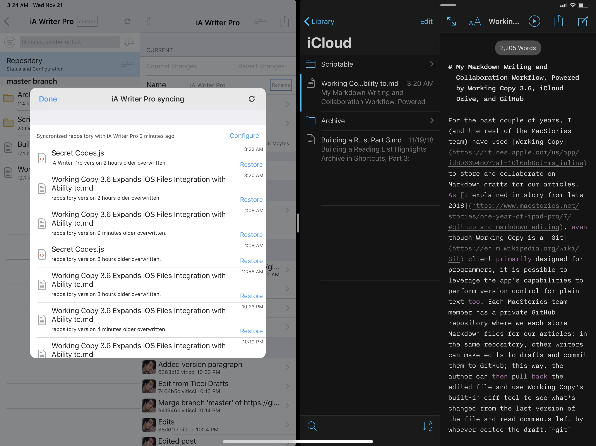
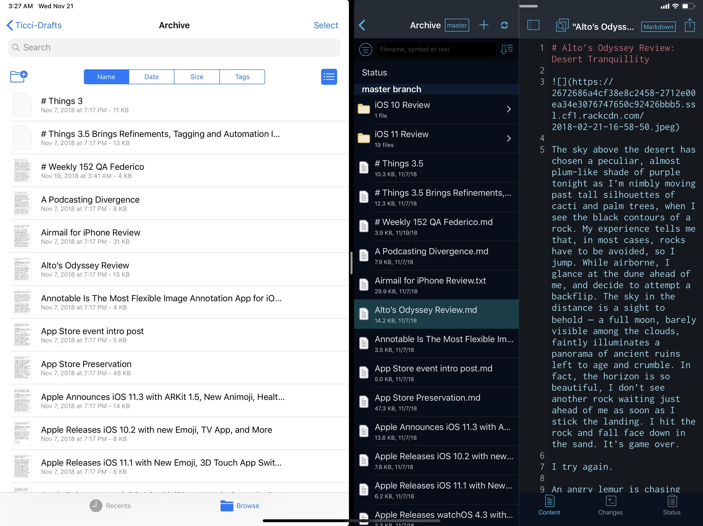
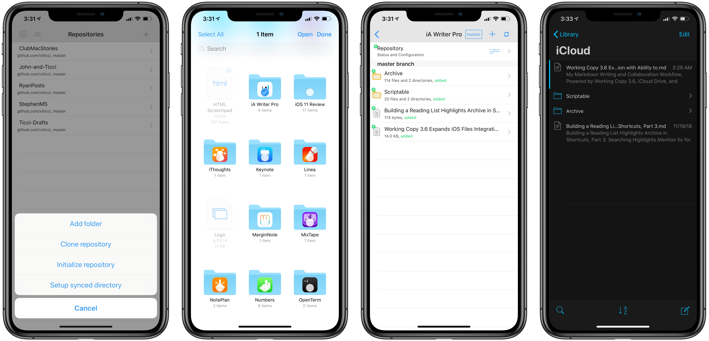
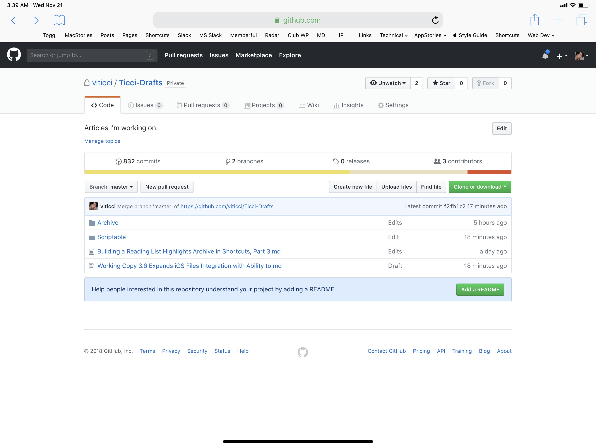
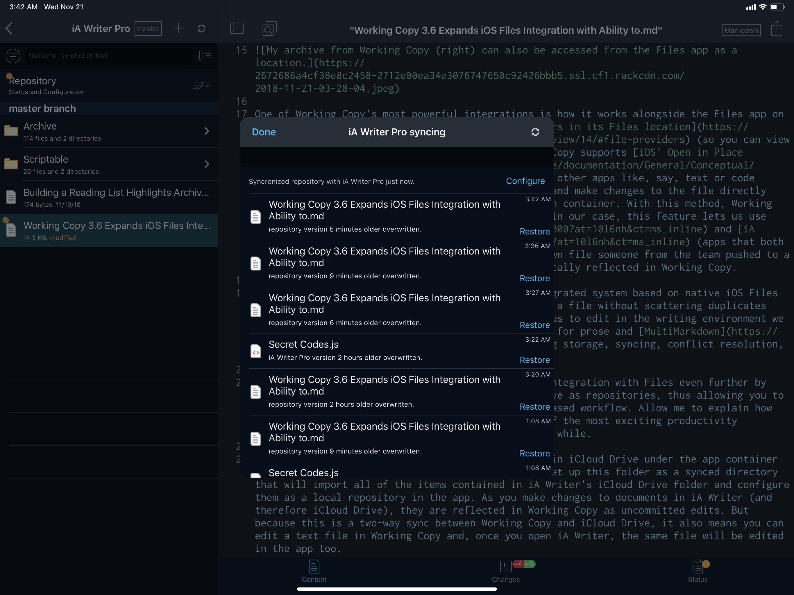
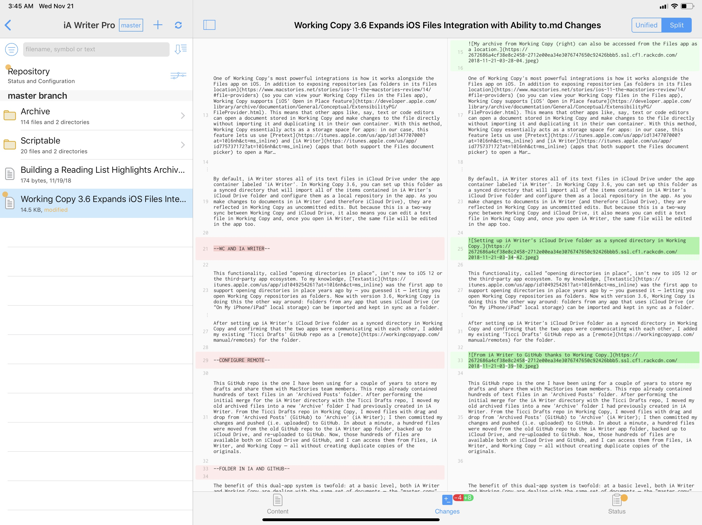
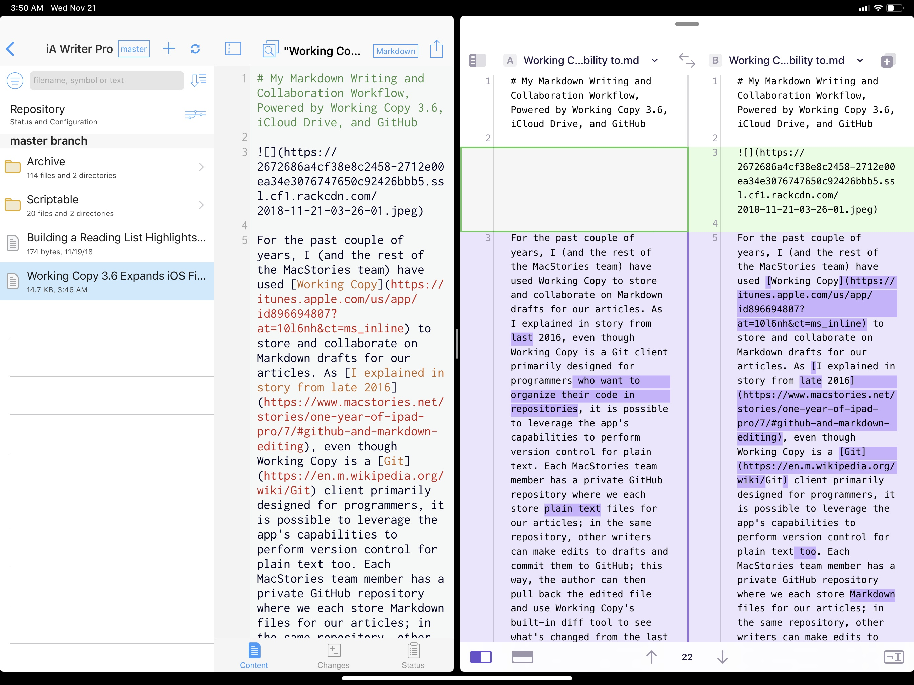
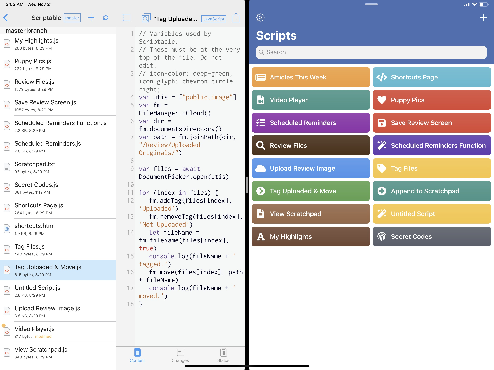

# My Markdown Writing and Collaboration Workflow, Powered by Working Copy 3.6, iCloud Drive, and GitHub - MacStories

Created: Oct 28, 2019 9:35 AM
URL: https://www.macstories.net/ios/my-markdown-writing-and-collaboration-workflow-powered-by-working-copy-3-6-icloud-drive-and-github/
reminder: @Today 7pm 

For the past couple of years, I (and the rest of the MacStories team) have used [Working Copy](https://itunes.apple.com/us/app/id896694807?at=10l6nh&ct=ms_inline) to store and collaborate on Markdown drafts for our articles. As [I explained in a story from late 2016](https://www.macstories.net/stories/one-year-of-ipad-pro/7/#github-and-markdown-editing), even though Working Copy is a [Git](https://en.m.wikipedia.org/wiki/Git) client primarily designed for programmers, it is possible to leverage the app’s capabilities to perform version control for plain text too. Each MacStories team member has a private GitHub repository where we store Markdown files of our articles; in the same repository, other writers can make edits to drafts and commit them to GitHub; this way, the author can then pull back the edited file and use Working Copy’s built-in diff tool to see what’s changed from the last version of the file and read comments left by whoever edited the draft.[1](https://www.macstories.net/ios/my-markdown-writing-and-collaboration-workflow-powered-by-working-copy-3-6-icloud-drive-and-github/)

As I mentioned two years ago, this system takes a while to get used to: GitHub has a bit of overhead in terms of understanding the correct terminology for different aspects of its file management workflow, but Working Copy makes it easier by abstracting much of the complexity involved with committing files, pushing them, and comparing them. This system has never failed us in over two years, and it has saved us dozens of hours we would have otherwise spent exchanging revised versions of our drafts and finding changes in them. With Working Copy, we can use [the text editors we each prefer](https://www.macstories.net/stories/choosing-your-markdown-editor-a-comparison-of-ulysses-and-drafts/) and, as long as we overwrite the original copies of our drafts and keep track of commits, the app will take care of merging everything and displaying differences between versions. From a collaboration standpoint, using Working Copy and GitHub for file storage and version control has been one of the best decisions I made in recent years.

The beauty of Working Copy – besides its support for various advanced Git features – is that it’s an amazing iOS citizen. Developer Anders Borum is always quick to add support for the latest iOS devices and APIs, and his app is at the bleeding edge of modern iOS technologies when it comes to automation, integration with other apps, and [support for iOS’ system-wide Files layer](https://www.macstories.net/reviews/working-copy-integrates-with-the-files-app-and-drag-and-drop/).

My archive from Working Copy (right) can also be accessed from the Files app as a location.

One of Working Copy’s most powerful integrations is how it works alongside the Files app on iOS. In addition to exposing repositories [as folders in its Files location](https://www.macstories.net/stories/ios-11-the-macstories-review/14/#file-providers) (so you can view your Working Copy files in the Files app), Working Copy supports [iOS’ Open in Place feature](https://developer.apple.com/library/archive/documentation/General/Conceptual/ExtensibilityPG/FileProvider.html). This means that other apps like, say, text or code editors can open a document stored in Working Copy and make changes to the file directly without importing it and duplicating it in their own container. With this method, Working Copy essentially acts as a storage space for apps: in our case, this feature lets us use [Pretext](https://itunes.apple.com/us/app/id1347707000?at=10l6nh&ct=ms_inline) and [iA Writer](https://itunes.apple.com/us/app/id775737172?at=10l6nh&ct=ms_inline) (apps that both support the Files document picker) to open a Markdown file someone from the team pushed to a repo so we can edit it and have changes be automatically reflected in Working Copy.

This is convenient for two reasons: first, the integrated system based on native iOS Files APIs allows us to work with the original version of a file without scattering duplicates across multiple apps; more importantly, it enables us to edit in the writing environment we prefer (Working Copy’s text editor is not optimized for prose and [MultiMarkdown](https://fletcherpenney.net/multimarkdown/)) while delegating storage, syncing, conflict resolution, and collaboration to Working Copy.

With today’s 3.6 update, Working Copy extends its integration with Files even further by letting you sync entire app folders from iCloud Drive as repositories, thus allowing you to manage documents from third-party apps in its Git-based workflow. Allow me to explain how this works in practice, because I think it is one of the most exciting productivity enhancements for iOS file management I’ve seen in a while.

By default, iA Writer stores all of its text files in iCloud Drive under the app container labeled ‘iA Writer’. In Working Copy 3.6, you can set up this folder as a synced directory that will import all of the items contained in iA Writer’s iCloud Drive folder and configure them as a local repository in the app. As you make changes to documents in iA Writer (and therefore iCloud Drive), they are reflected in Working Copy as uncommitted edits. But because this is a two-way sync between Working Copy and iCloud Drive, it also means you can edit a text file in Working Copy and, once you open iA Writer, the same file will be edited in the app too.

Setting up iA Writer’s iCloud Drive folder as a synced directory in Working Copy.

This functionality, called “opening directories in place”, isn’t new to iOS 12 or the third-party app ecosystem. To my knowledge, [Textastic](https://itunes.apple.com/us/app/id1049254261?at=10l6nh&ct=ms_inline) was the first app to support opening directories in place years ago by – you guessed it – letting you open Working Copy repositories as folders. Now with version 3.6, Working Copy is doing this the other way around: folders from any app that uses iCloud Drive (or “On My iPhone/iPad” local storage) can be imported and kept in sync as a folder.

Where all of this gets *really* interesting is if you also set up a GitHub repository as a “remote” for a synced app directory. This allows you to sync an app folder with Working Copy *and* to push the contents of the mirrored local folder to an online repo on GitHub too. Again, let me explain this with an actual example.

After setting up iA Writer’s iCloud Drive folder as a synced directory in Working Copy and confirming that the two apps were communicating with each other, I added my existing ‘Ticci Drafts’ GitHub repo as a [remote](https://workingcopyapp.com/manual/remotes) for the folder.

From iA Writer to GitHub thanks to Working Copy.

This GitHub repo is the one I have been using for a couple of years to store my drafts and share them with MacStories team members. This repo already contained hundreds of text files in an ‘Archived Posts’ folder. After performing the initial merge for the iA Writer directory with the Ticci Drafts repo, I moved my old archived files into a new ‘Archive’ folder I had previously created in iA Writer. From the Ticci Drafts repo in Working Copy, I moved files with drag and drop from ‘Archived Posts’ (GitHub) to ‘Archive’ (iA Writer); I then committed my changes and pushed (i.e. uploaded) to GitHub. In about a minute, a hundred files were moved from the old GitHub repo to the iA Writer app folder, backed up to iCloud Drive, and re-uploaded to GitHub. Now, those hundreds of files are available both on iCloud Drive and GitHub, and I can access them from Files, iA Writer, and Working Copy – all without creating duplicate copies of the originals.

The benefit of this dual-app system is twofold: at a basic level, both iA Writer and Working Copy are dealing with the same set of documents – the “master copy” that is stored in iCloud Drive on my devices and available to every iOS app. But because the iA Writer folder is also mirrored to GitHub, all my files and folders are backed up in a shared space where my teammates can access my drafts and edit them. All I need to do is keep writing in iA Writer as usual, then commit and push the iA Writer folder to the ‘Ticci Drafts’ GitHub repo. This integrated writing and sharing setup cuts one step from my workflow: I no longer have to manually export a document version from iA Writer because edited files are already available in Working Copy, ready to be committed to GitHub.

As you can imagine, the opposite is also true: if someone else from the MacStories team makes an edit to a text file in the shared Ticci Drafts GitHub repo, syncing and merging that repo in Working Copy results in the original file being mirrored back to iCloud Drive and iA Writer. For instance, if Ryan edits a draft I pushed to GitHub, syncing his changes back to my devices will make the edited file appear as a new version of the original file in iA Writer. Thanks to Working Copy’s support for versions and file restore, I can tap the ‘sync’ icon at the top of the iA Writer synced directory and view all versions of the file and restore a specific one if I don’t like the changes. I can also compare changes between versions in Working Copy with its built-in diff tool or drag and drop individual versions into [Kaleidoscope](https://itunes.apple.com/us/app/id1273771160?at=10l6nh&ct=ms_inline), which has a superior diff viewer.

Working Copy can keep track of versions from the synced iA Writer directory.

The built-in diff viewer for versions in Working Copy.

The more flexible diff viewer of Kaleidoscope for iOS.

So, to recap, this kind of setup allows me to:

- Write and edit files in iA Writer, which stores everything in iCloud Drive;
- Automatically mirror iA Writer’s iCloud Drive folder to Working Copy;
- Manually push changes to my text files to a private GitHub repository shared with my teammates;
- Merge edits from Ryan and John back to iA Writer, iCloud Drive, and Working Copy, all in one go.

There is very little management involved with this system; it is considerably better than my old process, which consisted of two separate sets of files (iCloud vs. GitHub) that I needed to manually reconcile every time. With this new approach, I always have access to every version of a file and I can continue working in iA Writer, using Working Copy as a middleman between iCloud Drive and GitHub. It’s pure Markdown collaboration bliss.

The ability for Working Copy 3.6 to open app directories in place isn’t exclusive to iA Writer. As I mentioned above, any iOS app that uses iCloud Drive for document storage is eligible for this integration – with varying degrees of utility, of course. While I wouldn’t recommend mirroring [Pixelmator](https://itunes.apple.com/us/app/id924695435?at=10l6nh&ct=ms_inline)’s image library to Working Copy, developer Anders Borum has collaborated with the makers of [Codea](https://itunes.apple.com/us/app/id439571171?at=10l6nh&ct=ms_inline), [Scriptable](https://itunes.apple.com/us/app/id1405459188?at=10l6nh&ct=ms_inline), and other apps to ensure compatibility with the new feature.

In my tests with Working Copy 3.6, I was able to take my existing library of JS scripts from the Scriptable app (which are stored in iCloud Drive) and mirror them to a sub-folder in my Ticci Drafts GitHub repo. To sync an app directory with a specific folder in Working Copy, you can select the folder, tap the share icon in the upper right corner of the title bar, then choose ‘Files Sync’. This will allow you to point the folder to a specific app directory from iCloud Drive and set up sync between the two locations.

Scriptable’s iCloud Drive folder, synced with Working Copy.

After creating a ‘Scriptable’ folder in my GitHub repo, I set up Files Sync with the Scriptable app directory from iCloud Drive and performed the initial commit and merge. Once that was done, everything was mirrored back to iCloud Drive into my iA Writer folder, which means I now have access to Markdown files and JS scripts in a single text editor. And, of course, if I make any changes to a Scriptable document from Working Copy, or iA Writer, or apps like [Kodex](https://itunes.apple.com/us/app/id1038574481?at=10l6nh&ct=ms_inline) and Pretext, those edits will be reflected in the main Scriptable app as well.

In the two years I’ve spent using Working Copy, I’ve learned that the more an app can integrate with iOS’ native Files layer, the better the overall experience is for me as a writer who works from an iPad Pro. Even before today’s update, the ability to have my version control system available from the Files document browser outclassed any other solution I had tried in the past.

Working Copy 3.6 makes a strong argument in favor of using iCloud Drive, supporting Files’ Open in Place APIs, and, generally speaking, [implementing modern iOS features](https://developer.apple.com/videos/play/wwdc2017/229/) for document collaboration. While these APIs and the Files document browser were somewhat buggy when they were introduced in iOS 11, I never experienced a single issue with Working Copy’s open-in-place mode, nor did I notice any conflicts with iA Writer, Scriptable, or other apps that used iCloud Drive for storage. I set up app directory sync and, for the most part, forgot about it. When I’m working on my iPad, I commit changes from iA Writer’s repo to my main GitHub one, now with the added benefit that *every* file is going to be backed up, not just the ones I exported. Thanks to this feature, more than ever before, I am now seeking out apps that are based on iCloud Drive for document storage; with some exceptions, I see custom sync and storage approaches that do not integrate with the rest of iOS as downsides given the Files-centric workflow I’ve established.

Whether you’re a writer or a programmer or just need to collaborate with someone on specific documents, and particularly if GitHub makes sense for your needs, I highly recommend checking out Working Copy and its new Files integration. I’m glad I started using this app two years ago, and I’m amazed by how much its developer continues to push the envelope for what is possible with file management on iOS.

Club MacStories offers exclusive access to **extra MacStories content**, delivered every week; it’s also a way to support us directly.

Club MacStories will help you discover the best apps for your devices and get the most out of your iPhone, iPad, and Mac. It’ll also give you access to advanced iOS shortcuts, tips and tricks, and lots more.

Starting at $5/month, with an annual option available.

- **MacStories Weekly** newsletter, delivered every week on Friday with app collections, tips, iOS workflows, and more;
- **MacStories Unplugged** podcast, published monthly with discussions on what we’re working on and more;
- **Monthly Log** newsletter, delivered once every month with behind-the-scenes stories, app notes, personal journals, and more;
- **Access** to occasional giveaways, discounts, and free downloads.