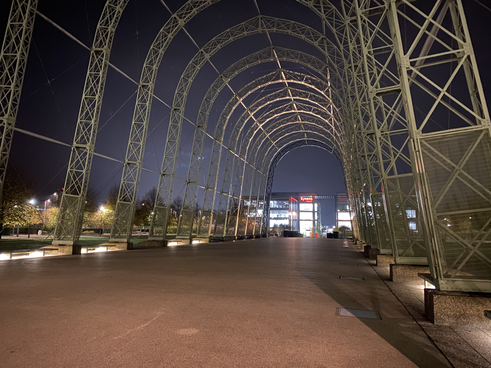
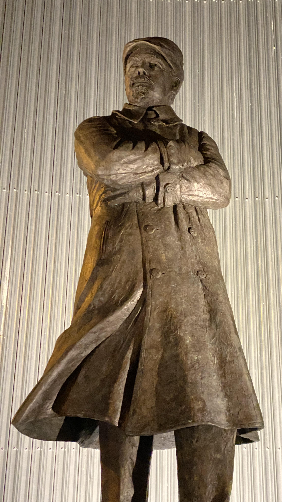
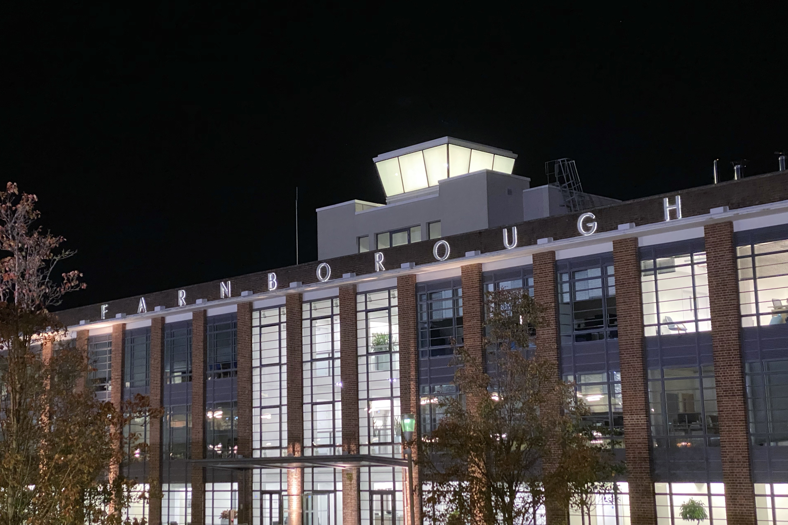
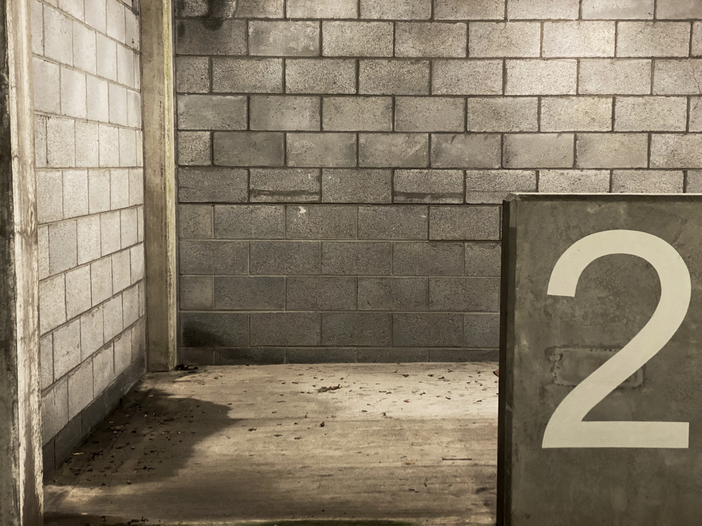
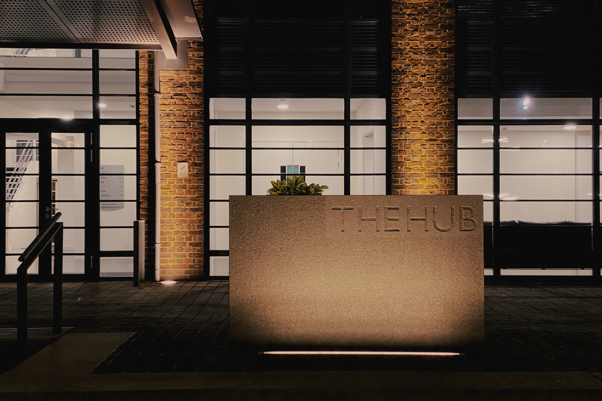
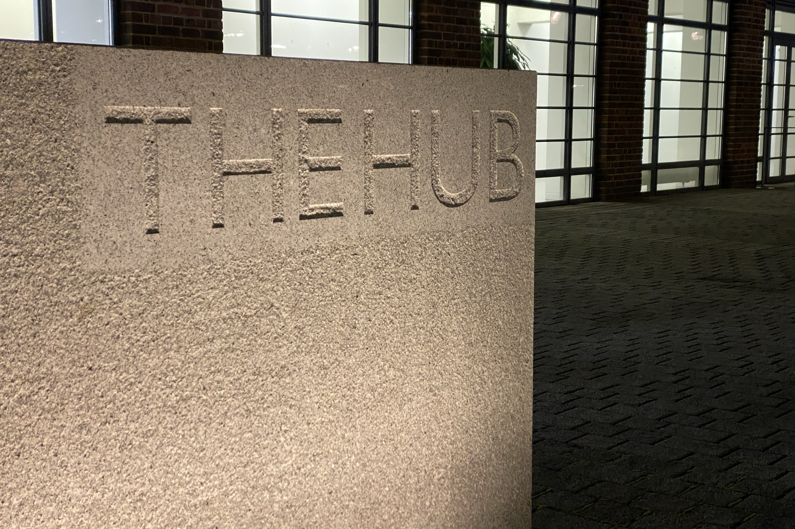

## iPhone 11 

You may recall in my last post I mentioned that I'd ordered my new iPhone 11 Pro Max from Vodafone as an upgrade. I had a few problems with the order and Vodafone let me down a bit initially but after I made a complaint about their disjointed service, I didn't need to wait for 3 weeks for delivery, it came through in four days!

Grumbles to one side, let's take a look at what this device can do. This isn't a review, I don't tend to write reviews but if it ends up sounding like a review, it wasn't intended to be! I am also mainly reviewing (sorry, not reviewing) the iPhone 11 Pro Max as a camera. I shall talk more tech in future posts, as I plan to do that anyway as I sharpen my blogging repertoire.

So far I've tested it in two very different scenarios: Night time around Farnborough and in the wilderness of the Brecon Beacons, Wales! In both cases I was faced with tricky lighting conditions which challenged me a bit but the iPhone seemed to cope incredibly well, a far cry from what phone based cameras used to be like in the early 2000's.

## Farnborough Business Park - night mode
- the following images demonstrate night photography shot around Farnborough

The Business Park next to Farnborough's Airport was borne out of what used to be the old RAE site and is now a spectacular mix of modern offices, a hotel and lovingly restored heritage buildings. One of these structures is the Balloon Hangar that was fairly recently reinstated by a group of people who discovered it's parts stowed away in a building on the old site. They decided to resconstruct it and it has formed a fantastic centre piece for the business park. The former terminal building complete with it's control tower has been repurposed as smart modern offices. The old wind tunnels are well maintained and at certain times of the year you can take tours inside them, something I've not yet done and have been itching to do for years.

It's not far from where we live and we often walk over that way of an evening, plus it's good for night photography, which is what I headed out to do one evening about this time last week.

## ultra-wide angle

I love the ultra-wide angle lens that comes as one of the trio of lenses with the Max Pro, as it opens up a whole host of new opportunities and by jove it is very wide indeed. I like using it for perspectives where you wouldn't instantly reach for a 14mm focal length under normal circumstances like these shots here.

## video

- collate a video with a bit of music, push up to Vimeo and link in here

## pixelmator photo

- quick mention of this app £4.99
  
## The mighty Brecon Beacons

Apologies for this article being a bit short this week, to be frank it's incredible I've been able to push out an article at all, such a frantic week!

