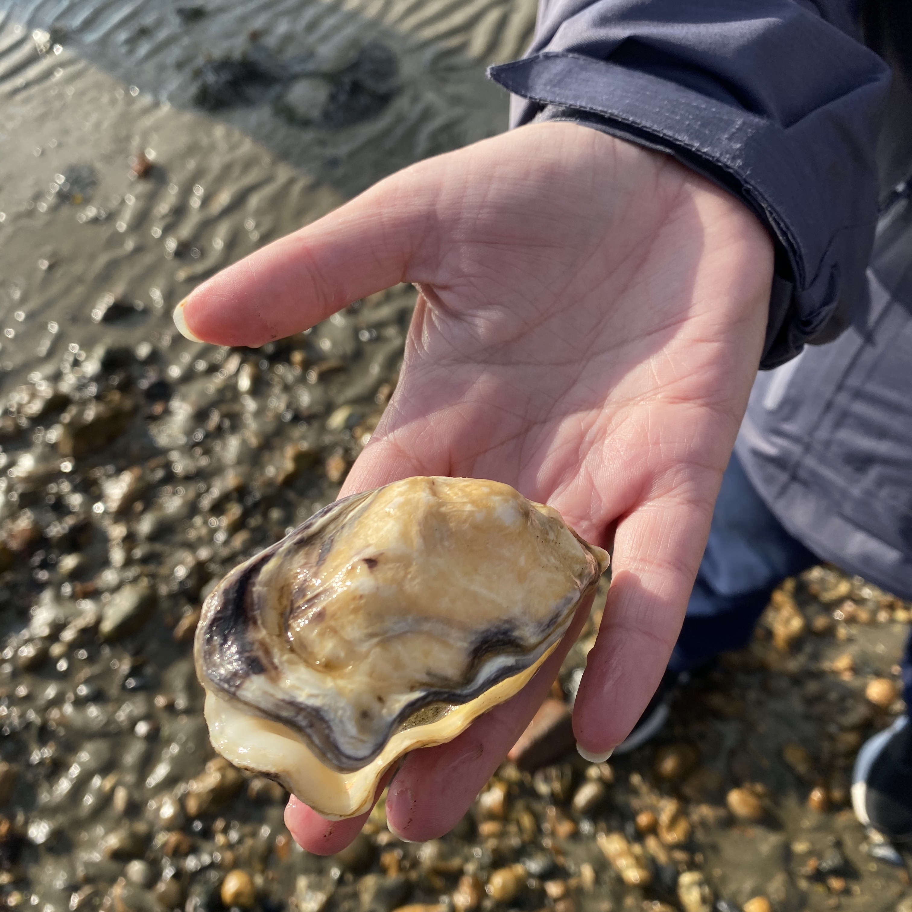
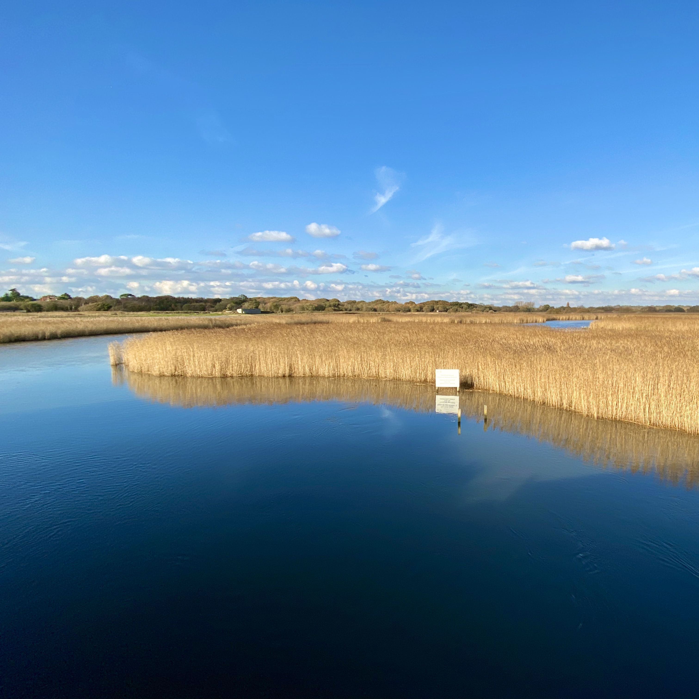

This week I move on to writing about some of the walks I enjoy around my home county of Hampshire. One day I would love to write a book about walks across the county, it’s people and the history that shaped it. Writing a book or two will be a long term project and will take quite some time, however in the meantime through the medium of blogging, I can publish some material to get going. So come and join me on a walk along part of the Solent way.

## Hill Head to Warsash
This walk starts from The Osborne View pub, always a great place to start, end or both!

## Watch out for
- Ringed Plover
- Avocet
- Marsh Harrier
- Plus many others it’s a great place for overwintering species and summer migrants alike
## Places to eat
- The Osborne View
- Titchfield Haven Cafe (is that it’s name?)
## Places to park

## Notes to self
- Instagram and stories should follow my walks
- See link in bio/profile to latest blog post
- Pinned tweet

## follow ons
- lunchtime walks (basingstoke)

## your walks
- tell us about yours